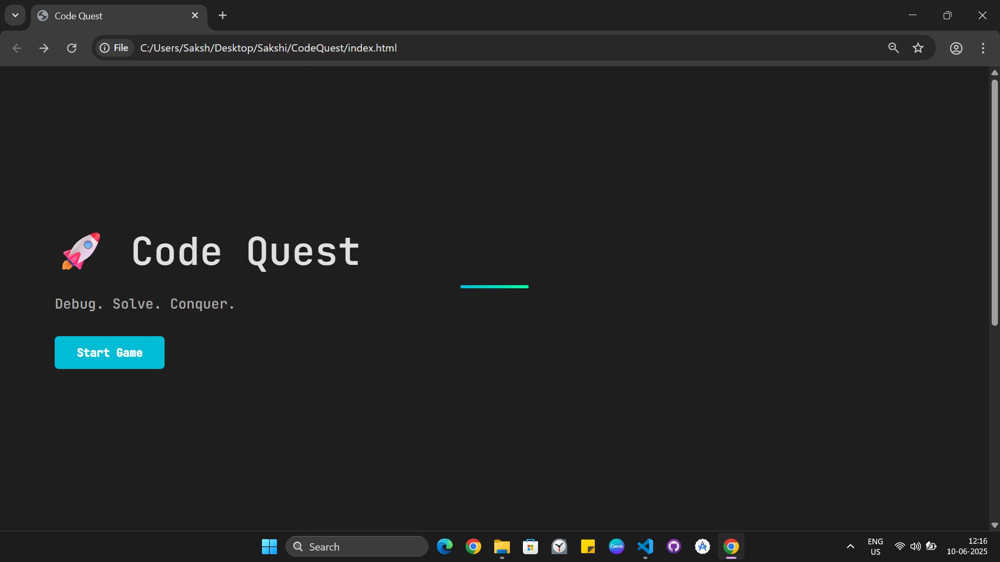

# 🚀 Code Quest: Language-Based Coding Challenges

Welcome to **Code Quest**, a fun and interactive web app where you can test your coding skills across **JavaScript**, **Python**, and **Java**. Each language has 3 levels: Easy, Medium, and Hard. Fix bugs, solve puzzles, and sharpen your brain – one challenge at a time!

---

## 🌟 Features

- 🎮 Three programming languages: JavaScript, Python, Java
- 🧩 Three difficulty levels per language
- 💡 Syntax, logic, and algorithm challenges
- 💻 Responsive & modern UI using HTML, CSS (Bootstrap), and JavaScript
- 🖼️ Language-based level switching
- 🎨 Styled with custom colors, shadows, and smooth transitions

---

## 🚀 How to Use

1. **Clone the repository:**
   ```bash
   git clone https://github.com/Sakshi-2508/BugBuster
   cd devfixer
   ```

2. **Open `index.html` in your browser.**
   > No build steps. It’s a fully static front-end app!

3. **Paste your error**, select the programming language, and hit **Find Solutions**.


## 🔥 Preview

### Landing Page  


### 🟨 JavaScript Levels  


### 🐍 Python Levels  


### ☕ Java Levels  


---

## 🛠️ Tech Stack

- **HTML5**
- **CSS3** with **Bootstrap 5**
- **Vanilla JavaScript**
- **Google Fonts (JetBrains Mono)**

---

## 🧠 Challenges Overview

| Language   | Challenge 1        | Challenge 2       | Challenge 3       |
|------------|--------------------|-------------------|-------------------|
| JavaScript | Fix the Bug 🐞     | Logic Puzzle 🧩    | Algorithm Race ⚡   |
| Python     | Syntax Fix 🐍      | Loop Mastery 🔁    | Algorithm Crunch 🧠 |
| Java       | Hello Debug 💻     | Loop Maze 🌀       | Class Architect 🏗️  |

---

## 📂 Folder Structure

```
📁 CodeQuest
├── 📄 index.html *(optional home)*
├── 📄 levels.html *(JavaScript)*
├── 📄 pylevels.html *(Python)*
├── 📄 javalevels.html *(Java)*
├── 📁 screenshots
│   ├── javascript.png
│   ├── python.png
│   └── java.png
```

---

## 🚀 Getting Started

Just open any HTML file in your browser:

```bash
levels.html          # For JavaScript challenges
pylevels.html        # For Python challenges
javalevels.html      # For Java challenges
```

Or host it with GitHub Pages!

---

## 🙌 Contribute

Want to add more challenges, languages, or animations? Fork this repo and start coding!

---

## 📜 License

This project is open-source and free to use under the [MIT License](LICENSE).

---

> 💡 _“Code is like humor. When you have to explain it, it’s bad.”_ — Cory House

## 👨‍💻 Created by

**Sakshi Angre** — Frontend Developer @Heatic

> 🚀 *Empowering developers to solve bugs faster, one error at a time.*


## 🔗 Connect with Me

* GitHub: [@Sakshi-2508](https://github.com/Sakshi-2508)
* LinkedIn: [sakshi0825](https://www.linkedin.com/in/sakshi0825/)